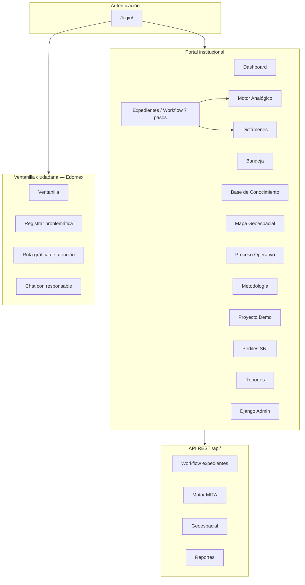
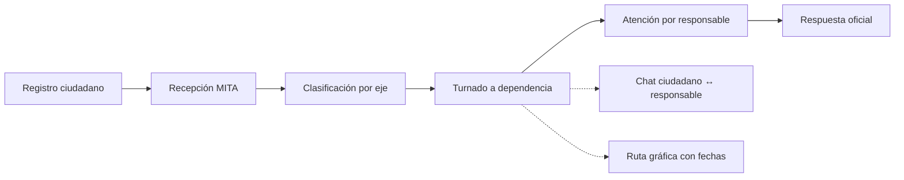

# Mapa de funcionalidad — Plataforma MITA

**Multi-Intercultural-Transdisciplina Analógica**  
Gobierno del Estado de México · Versión documental 2026

---

## 1. Propósito del documento

Este mapa describe **todas las funcionalidades** de la plataforma MITA, su relación con los **requisitos funcionales (RF-01 a RF-11)**, la **matriz de roles y privilegios**, las **rutas web**, las **APIs** y los **flujos operativos** institucionales y ciudadanos.

**Leyenda de privilegios**

| Símbolo | Significado |
|---------|-------------|
| **A** | Administración completa (crear, editar, avanzar, eliminar según módulo) |
| **G** | Gestión operativa dentro del ámbito del rol |
| **C** | Solo consulta / lectura |
| **E** | Acceso exclusivo del rol |
| **—** | Sin acceso |

---

## 2. Modelo de roles

La plataforma define seis roles en `PerfilUsuario.Rol`, con jerarquía numérica para comparación de permisos en expedientes:

| Rol | Clave | Nivel | Usuario demo | Contraseña demo |
|-----|-------|-------|--------------|-----------------|
| Administrador | `admin` | 4 | `admin` | `mita2026` |
| Analista MITA | `analista` | 3 | `analista` | `mita2026` |
| Investigador SNI | `investigador` | 2 | `investigador` | `mita2026` |
| Dependencia gubernamental | `dependencia` | 1 | `dependencia` | `mita2026` |
| Auditor | `auditor` | 1 | `auditor` | `mita2026` |
| Público general (ciudadano) | `publico` | 0 | `ciudadano` | `mita2026` |

**Reglas generales**

- El menú lateral muestra **únicamente** las opciones permitidas para el rol autenticado (`core/navigation.py`).
- La ventanilla ciudadana (`/ciudadania/`) es **exclusiva** del rol `publico` (`@requiere_publico`).
- Los expedientes aplican `puede_ver_expediente` y `puede_gestionar_expediente` según paso activo y jerarquía de rol.
- El auditor tiene acceso de **consulta** a expedientes, dictámenes e indicadores; **no** puede modificar trámites.

---

## 3. Arquitectura funcional de alto nivel

---

## 4. Mapa de módulos y requisitos funcionales

| Módulo | Ruta principal | RF | Descripción funcional |
|--------|----------------|----|------------------------|
| Dashboard | `/` | RF-08, RF-11 | Resumen: expedientes, tareas, proyecto demo, métricas |
| Bandeja de trabajo | `/bandeja/` | RF-08 | Tareas pendientes por usuario y rol |
| Expedientes | `/expedientes/` | RF-08 | Ciclo de vida de casos institucionales (7 pasos) |
| Base de Conocimiento | `/base-datos/` | RF-01, RF-02 | Disciplinas, fuentes, selección paso 2 |
| Mapa Geoespacial | `/mapa/` | RF-07 | Hotspots, zonas, capas SIG Edomex |
| Proceso Operativo | `/proceso/` | RF-08 | Vista integrada del workflow y métricas |
| Metodología MITA | `/metodologia/` | RF-02 | Ejes analógicos A–F del marco metodológico |
| Proyecto Demo | `/proyecto/` | RF-05, RF-06 | EDOMEX Diabetes — referencia transdisciplinaria |
| Motor Analógico | `/analogia/` | RF-06 | Evaluación de propuestas y riesgos sesgado/radical/divagante |
| Dictámenes | `/dictamenes/` | RF-06, RF-08 | Listado y PDF de dictámenes de validación |
| Perfiles SNI | `/sni/` | RF-02 | Investigadores del Sistema Nacional |
| Reportes | `/reportes/` | RF-11 | Indicadores de impacto y lecciones aprendidas |
| Administración | `/admin/` | Seguridad | Django Admin — catálogos y usuarios |
| Ventanilla Ciudadana | `/ciudadania/` | Extensión | Portal público Edomex con IA y workflow de atención |
| API REST | `/api/` | RF-09–11 | Integración programática de todos los motores |

---

## 5. Menú lateral por rol

| Funcionalidad | Admin | Analista | Investigador | Dependencia | Auditor | Público |
|---------------|:-----:|:--------:|:------------:|:-----------:|:-------:|:-------:|
| Dashboard | ✓ | ✓ | ✓ | ✓ | ✓ | — |
| Bandeja de trabajo | ✓ | ✓ | ✓ | ✓ | — | — |
| Expedientes | ✓ | ✓ | ✓ | ✓ | ✓ | — |
| Registrar asunto | ✓ | — | — | ✓ | — | — |
| Base de Conocimiento | ✓ | ✓ | — | — | — | — |
| Mapa Geoespacial | ✓ | ✓ | — | — | — | — |
| Proceso Operativo | ✓ | ✓ | ✓ | ✓ | — | — |
| Metodología MITA | ✓ | ✓ | ✓ | — | — | — |
| Proyecto Demo | ✓ | ✓ | — | — | — | — |
| Motor Analógico | ✓ | ✓ | — | — | — | — |
| Dictámenes | ✓ | — | ✓ | — | ✓ | — |
| Perfiles SNI | ✓ | — | ✓ | — | — | — |
| Reportes | ✓ | — | — | — | ✓ | — |
| Administración Django | ✓ | — | — | — | — | — |
| Ventanilla Ciudadana | — | — | — | — | — | ✓ |
| Registrar problemática | — | — | — | — | — | ✓ |
| Ruta gráfica de atención | — | — | — | — | — | ✓ |

---

## 6. Matriz de privilegios por funcionalidad

### 6.1 Portal institucional

| Funcionalidad | Admin | Analista | Investigador | Dependencia | Auditor |
|---------------|:-----:|:--------:|:------------:|:-----------:|:-------:|
| Ver dashboard | C | C | C | C | C |
| Gestionar bandeja / tareas | A | G | G | G | — |
| Listar expedientes | C | C | C | C | C |
| Crear expediente | A | — | — | G | — |
| Ver detalle expediente | C | C | C | C | C |
| Editar paso expediente | A* | G* | G* | G* | — |
| Avanzar workflow | A* | G* | G* | G* | — |
| Consultar disciplinas | A | G | — | — | — |
| Seleccionar disciplinas (paso 2) | A | G | — | — | — |
| Cruce interdisciplinario (paso 3) | A | G | — | — | — |
| Evaluar analogía (paso 4) | A | G | — | — | — |
| Generar opciones (paso 5) | A | G | — | — | — |
| Evaluar y seleccionar (paso 6) | A | — | G | — | — |
| Emitir dictamen (paso 7) | A | — | — | — | — |
| Mapa / zonas geográficas | A | G | — | — | — |
| Motor analógico standalone | A | G | — | — | — |
| Generar dictamen PDF | A | G | — | — | — |
| Ver dictámenes | C | — | C | — | C |
| Perfiles SNI | A | — | G | — | — |
| Indicadores de impacto | A | — | — | — | C |
| Django Admin | A | — | — | — | — |

\* Solo si el nivel del rol es ≥ rol requerido por el paso activo, o es creador/responsable del expediente.

### 6.2 Ventanilla ciudadana (Estado de México)

| Funcionalidad | Público | Institucional |
|---------------|:-------:|:-------------:|
| Portal ciudadano | E | — |
| Registrar reporte por eje | E | — |
| Asistente IA pre-registro | E | — |
| Mapa de ubicaciones Edomex | E | — |
| Catálogo centros de salud | E | — |
| Número de control MITA-CIU | E | — |
| Ruta gráfica de atención | E | — |
| Workflow dependencias + fechas | E | — |
| Chat con responsable de atención | E | — |
| Ver reportes ciudadanos ajenos | — | — |

**Ejes temáticos ciudadanos:** Salud, Educación, Corrupción, Economía, Empleo, Seguridad, Agua.

---

## 7. Proceso operativo — 7 pasos y roles

| Paso | Nombre | Rol responsable | Herramientas vinculadas | Privilegio mínimo |
|:----:|--------|-----------------|-------------------------|-------------------|
| 1 | Definición del asunto | Dependencia | Formulario expediente | `dependencia` (G) |
| 2 | Recopilación de conocimiento | Analista | Base de Conocimiento | `analista` (G) |
| 3 | Organización y relación | Analista | Mapa, cruce interdisciplinario | `analista` (G) |
| 4 | Análisis y analogía | Analista | Motor Analógico | `analista` (G) |
| 5 | Generación de opciones | Analista | Motor Analógico, Proyecto | `analista` (G) |
| 6 | Evaluación y selección | Investigador SNI | Perfiles SNI | `investigador` (G) |
| 7 | Dictamen de validación | Administrador | Dictámenes, PDF | `admin` (G) |

**Estados de expediente:** Borrador → En proceso → Pendiente revisión → Dictaminado → En seguimiento → Cerrado / Cancelado.

---

## 8. Ventanilla ciudadana — flujo de atención

| Etapa | Dependencia | Datos registrados |
|-------|-------------|-------------------|
| Recepción | Ventanilla MITA | Número de control, validación |
| Clasificación | Coordinación eje | Eje temático, municipio Edomex |
| Atención directa | SEDESA, SEIEM, STPS, etc. | Responsable, fecha recepción, inicio atención |
| Coordinación | Dependencias secundarias | Roles interinstitucionales |
| Respuesta | Dependencia principal | Resolución o no procedencia |

---

## 9. Catálogo de rutas web

### 9.1 Institucionales

| Ruta | Nombre | Roles con menú |
|------|--------|------------------|
| `/` | Dashboard | admin, analista, investigador, dependencia, auditor |
| `/bandeja/` | Bandeja | admin, analista, investigador, dependencia |
| `/expedientes/` | Lista expedientes | Todos institucionales |
| `/expedientes/nuevo/` | Nuevo expediente | admin, dependencia |
| `/expedientes/<id>/` | Detalle / stepper | Según `puede_ver` / `puede_gestionar` |
| `/base-datos/` | Base de Conocimiento | admin, analista |
| `/mapa/` | Mapa geoespacial | admin, analista |
| `/proceso/` | Proceso operativo | admin, analista, investigador, dependencia |
| `/metodologia/` | Metodología | admin, analista, investigador |
| `/proyecto/` | Proyecto demo | admin, analista |
| `/analogia/` | Motor analógico | admin, analista |
| `/dictamenes/` | Dictámenes | admin, investigador, auditor |
| `/sni/` | Perfiles SNI | admin, investigador |
| `/reportes/` | Reportes | admin, auditor |
| `/admin/` | Django Admin | admin |

### 9.2 Ventanilla ciudadana

| Ruta | Nombre | Rol |
|------|--------|-----|
| `/ciudadania/` | Portal | publico |
| `/ciudadania/nuevo/` | Registrar problemática | publico |
| `/ciudadania/ruta-grafica/` | Workflow gráfico | publico |
| `/ciudadania/reporte/<id>/` | Detalle, ruta y chat | publico (propios) |
| `/ciudadania/api/asistente/` | Chat IA | publico |
| `/ciudadania/api/centros-salud/` | Catálogo ISSEM/SEDESA | publico |
| `/ciudadania/api/eje/<eje>/ubicaciones/` | Puntos Edomex | publico |
| `/ciudadania/api/reporte/<id>/chat/` | Chat responsable | publico |
| `/ciudadania/api/reporte/<id>/ruta/` | Estado ruta JSON | publico |

---

## 10. API REST — mapa de endpoints

| Endpoint | Método | Función | Uso típico por rol |
|----------|--------|---------|---------------------|
| `/api/health/` | GET | Estado del servicio | Operaciones |
| `/api/expedientes/` | GET, POST | Listar / crear | dependencia, analista, admin |
| `/api/expedientes/<id>/` | GET | Detalle | Todos institucionales |
| `/api/expedientes/<id>/paso/` | POST | Guardar paso | Según paso activo |
| `/api/expedientes/<id>/avanzar/` | POST | Avanzar workflow | Según paso activo |
| `/api/bandeja/` | GET | Tareas pendientes | analista, dependencia, admin |
| `/api/mita/cruce/` | POST | Cruce interdisciplinario | analista |
| `/api/mita/analogia/` | POST | Evaluación analógica | analista |
| `/api/mita/dictamen/` | POST | Generar dictamen + PDF | analista, admin |
| `/api/mita/dictamen/<id>/pdf/` | GET | Descargar PDF | investigador, auditor, admin |
| `/api/geoespacial/zonas/` | GET | Zonas SIG | analista |
| `/api/reportes/indicadores/` | GET | KPIs impacto | auditor, admin |
| `/api/buscar/` | GET | Búsqueda semántica | analista, admin |

---

## 11. Matriz RF × Rol (resumen)

| RF | Descripción | Roles con acceso principal |
|----|-------------|----------------------------|
| RF-01 | Base de conocimiento | admin, analista |
| RF-02 | Multi-interdisciplina / SNI | admin, analista, investigador |
| RF-03 | Cruces interdisciplinarios | admin, analista |
| RF-04 | Interculturalidad | admin, analista |
| RF-05 | Síntesis transdisciplinaria | admin, analista |
| RF-06 | Motor analógico / dictámenes | admin, analista, investigador, auditor (C) |
| RF-07 | Geoespacial Edomex | admin, analista, publico (centros salud) |
| RF-08 | Workflow expedientes | admin, analista, investigador, dependencia, auditor (C) |
| RF-09 | Búsqueda API | admin, analista |
| RF-10 | Legislación | admin, analista (API) |
| RF-11 | Reportes impacto | admin, auditor |
| — | Ventanilla ciudadana | publico (E) |

---

## 12. Redirección post-login por rol

| Rol | Destino por defecto |
|-----|---------------------|
| `publico` | `/ciudadania/` |
| `dependencia` | `/expedientes/nuevo/` |
| `analista` | Expediente demo activo (paso 4) o bandeja |
| `investigador` | Expediente demo activo (paso 6) |
| `admin` | Expediente demo activo (paso 7) |
| `auditor` | Expediente demo dictaminado |

---

## 13. Auditoría y trazabilidad

- Registro en `RegistroAuditoria` para acciones críticas (API workflow, dictámenes, cruces).
- Transiciones de expediente en `TransicionExpediente`.
- Mensajes de chat ciudadano en `MensajeReporteCiudadano`.
- Dictámenes con PDF almacenado en `media/dictamenes/`.

---

## 14. Referencias técnicas

| Artefacto | Ubicación |
|-----------|-----------|
| Definición de roles | `core/models.py` → `PerfilUsuario.Rol` |
| Permisos y jerarquía | `core/permissions.py` |
| Menú por rol | `core/navigation.py` |
| Workflow 7 pasos | `mita_engine/workflow.py` → `PASOS` |
| Ventanilla ciudadana | `core/ciudadania_*` |
| URLs web | `mita_platform/urls.py` |
| URLs API | `api/urls.py` |

---

*Documento generado para la Plataforma MITA — Estado de México. Complementa la Ficha Técnica y el Manual de Usuario.*
